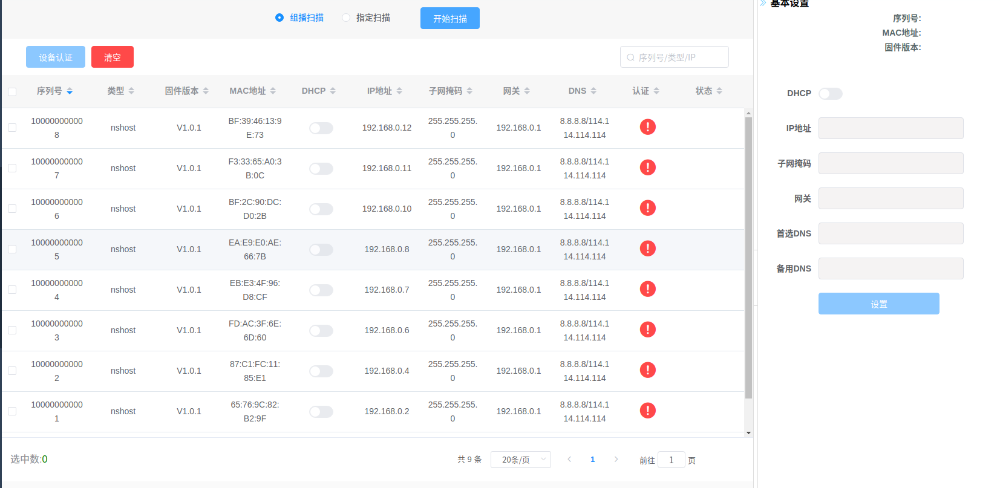

# 产品需求与接口

## 需求



1. 进入页面：
  - 与 mqtt broker 建立连接
  - 订阅设备发现通知主题
2. 退出页面：
  - 与 mqtt broker 断开连接
  - 退订设备发现通知主题
3. 点击“开始扫描”：
  - 构造相关请求，发送给服务器，如果成功则按钮文字变为“停止扫描”
  - 接收设备发现通知，添加已发现的设备到页面列表
4. 点击“停止扫描”，构造相关请求，发送给服务器，如果成功则按钮文字变为“开始扫描”
5. 点击设备列表某一项
  - 侧边栏显示相应设备的数据
  - 点击侧边栏“设置”，构造提交数据请求，发送给服务器，如果成功则更新设备数据并提示“设置成功”，失败则提示“设置失败”
6. 设备列表应分页渲染，每页 20 项
7. 页面使用 vue-cli + webpack + element-ui 开发，web 请求使用 axios 发送和接收

## 接口

1. mqtt broker
  - 地址：`192.168.110.12`
  - 端口：`8083`
2. 设备发现通知：
  - 主题：`/voerkadev/`
  - 消息格式：
```js
{
  "type" : 10,
  "sid" : 0,
  "tid" : 0,
  "from" : "408d5c9bd7cd",
  "to" : "",
  "flags" : { },
  "timestamp" : 1562133595113,
  "payload" : {
    "Header" : "MEEYI",
    "SN" : "100000000001",  // 序列号
    "Type" : "nshost",  // 类型
    "Model" : "MockDev:192.168.1.190",  // 型号
    "Version" : "V1.0.1",  // 固件版本
    "Domain" : "hispro",
    "MQTT" : "mqtt://mqtt.huanyutong.com:1883",
    "MQTT_Username" : "",
    "MQTT_Password" : "",
    "Networks" : [ {
      "Interface" : "eth1",
      "MAC" : "C1:8F:1A:69:23:5A",  // MAC 地址
      "DHCP" : 0,  // dhcp
      "IP" : "192.168.0.3",  // ip 地址
      "SubnetMask" : "255.255.255.0",  // 子网掩码
      "Gateway" : "192.168.0.1",  // 网关
      "DNS_prefer" : "8.8.8.8",  // 首选 DNS
      "DNS_alter" : "114.114.114.114"  // 备选 DNS
    }, {
      "Interface" : "eth0",
      "MAC" : "C4:ED:3A:F4:62:04",
      "DHCP" : 0,
      "IP" : "192.168.0.4",
      "SubnetMask" : "255.255.255.0",
      "Gateway" : "192.168.0.1",
      "DNS_prefer" : "8.8.8.8",
      "DNS_alter" : "114.114.114.114"
    } ],
    "WIFI_AP" : "",
    "WIFI_Enable" : 0,
    "WIFI_Secret" : 0,
    "WIFI_Password" : "",
    "Location" : "VIP",
    "Long" : 0,
    "Lati" : 0,
    "ConfigPort" : 2887,
    "Source" : "MULTICAST",
    "Authorized" : true
  }
}
```
3. 开始扫描请求：
  - 请求：`GET http://192.168.118.190:9001/api/devices/search/start`
  - 响应：
```js
{
    "status": "success",  // 成功是 success；失败是 failed
    "message": "用作提示文本",
    "payload": {}
}
```
4. 停止扫描请求：
  - 请求：`GET http://192.168.118.190:9001/api/devices/search/stop`
  - 响应：
```js
{
    "status": "success",  // 成功是 success；失败是 failed
    "message": "用作提示文本",
    "payload": {}
}
```
5. 设置设备请求：
  - 请求：`PATCH http://192.168.118.190:9001/apps/hispro/api/devices/:设备序列号SN/attributes`
  - 响应：
```js
{
    "status": "success",  // 成功是 success；失败是 failed
    "message": "用作提示文本",
    "payload": {}
}
```
